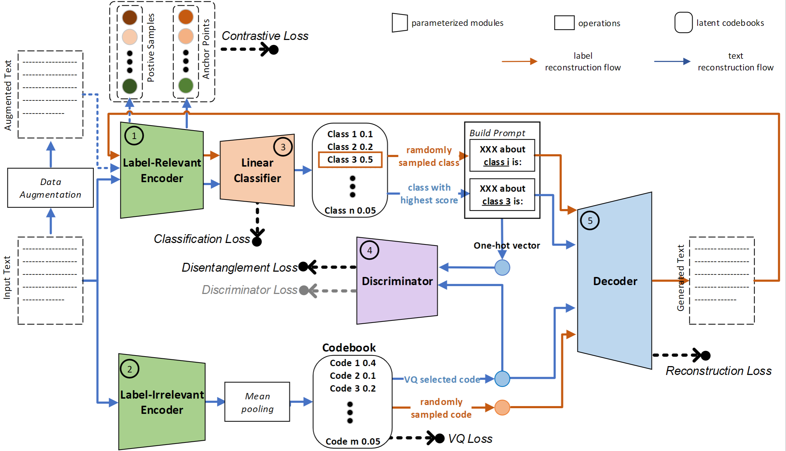

# ZeroAE: Pre-trained Language Model based Autoencoder for Transductive Zero-shot Text Classification

This is the Pytorch implementation of ZeroAE in the paper: [ZeroAE: Pre-trained Language Model based Autoencoder for Transductive Zero-shot Text Classification]

<b>Figure 1.</b> The network architecture of ZeroAE.

## Requirements
* Ubuntu OS
* Python 3.9
* pytorch 1.8.0
* CUDA 11.1

Dependencies can be installed by:

    pip install -r requirements.txt

## Data preparetion
The first three datasets (Situation, Topic, and Emotion) used in this paper can be downloaded from the following links:
* https://github.com/CogComp/Benchmarking-Zero-shot-Text-Classification

The downloaded datasets can be put in the 'data' directory. 

To preprocess the dataset, running:

    source init.sh && python ./train/download_topic.py --emb_type bert --init False

## Training
To train the model on the topic dataset, run:

    python -m torch.distributed.launch --nproc_per_node 4 ./train/train_topic_entail.py

The meaning of each command line argument is explained in train_topic_entail.py, train_situation_entail.py, train_emotion_entail and train_kesu_entail, respectively.

## Evaluate

TODO

## Citation

    @inproceedings{guo-etal-2023-zeroae,
        title = "{Z}ero{AE}: Pre-trained Language Model based Autoencoder for Transductive Zero-shot Text Classification",
        author = "Guo, Kaihao and Yu, Hang and Liao, Cong and Li, Jianguo and Zhang, Haipeng",
        booktitle = "Findings of the Association for Computational Linguistics: ACL 2023",
        year = "2023",
        publisher = "Association for Computational Linguistics",
        url = "https://aclanthology.org/2023.findings-acl.200",
        pages = "3202--3219",
    }

## Contact

For any questions w.r.t. ZeroAE, please submit them to Github Issues.
